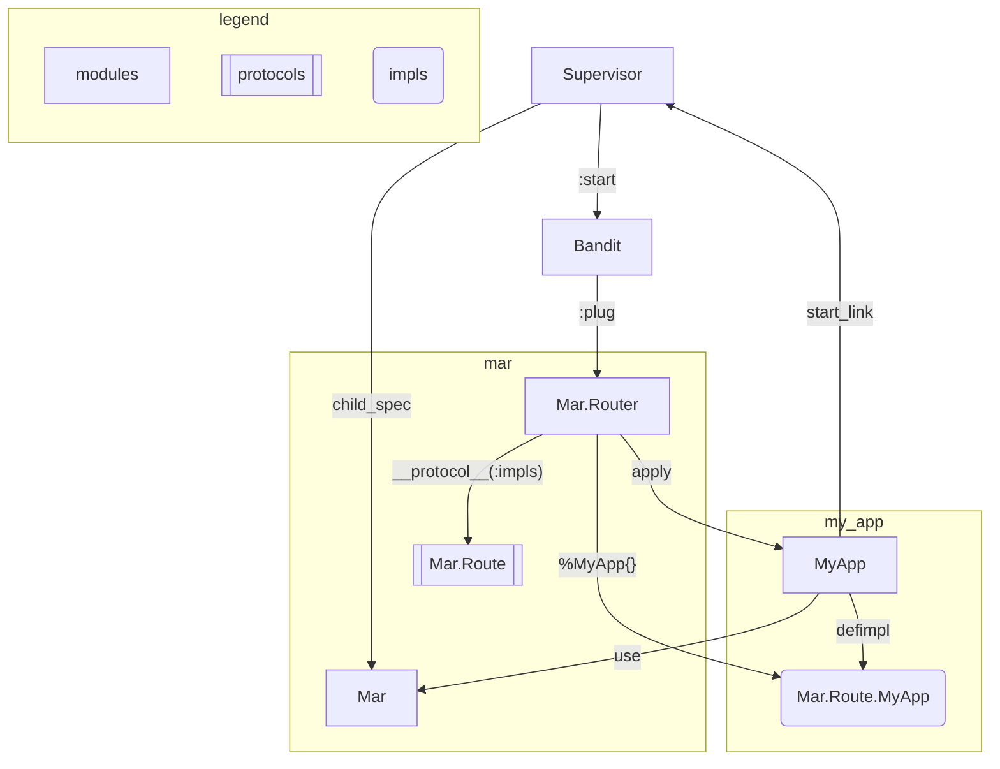

# Mar — Simple Web in Elixir

[Video Demo](https://youtu.be/lcec6JbynYo)

Mar is a simple web framework written in Elixir functional programming language. The design of the library aims to provide a Flask-like experience for Elixir developers. It is a layer of abstraction on top of [Plug](https://github.com/elixir-plug/plug) powered by [Bandit](https://github.com/mtrudel/bandit).

## Roadmap

### 0.3

- Find a value proposition [The discussion](https://elixirforum.com/t/62885) has generated ideas
  - DSL for text protocols.
  - Abstraction over web protocols
  - Exit from MVC model
- Protocol consolidation is fragile. Move module registry to ETS.
- José says: put functions at the center, not modules.

### 1.0

- Full web development platform
- HTMX integration
- Zero-to-hero learning pages

## Design



The design goal for Mar is to make it _transparent_ to the user so someone who just covered the basics of the language can jump right into building a web application. Elixir offers a powerful and aesthetic syntax built-in, such as multi-clause function definitions with parameters pattern matching module with struct definition, `@behaviour` and `Protocol` for polymorphism, and `use` macro that injects code into the module. Mar attempts to fully utilise these native features to provide a simple and intuitive API for building web applications.

For the user, such brevity means typing in `use Mar` makes all the connections and sets up reasonable defaults so a web application is defined without an extra file in the `lib/`. With object-oriented programming, it's as simple as passing an object. That's what we see from Flask, Sinatra or Express. The object can encapsulate the state and operation of the application without too much ceremony on the user's codespace. But for the functional programming paradigm, it usually spills out to the user modules. To manage this, Mar has to keep as much as possible in the library. And it takes accessing the module information of the user code from the library.

I was surprised by the level of frustration such an approach can cause. At first, I thought it was me that I couldn't come up with an elegant solution right up. But as I dug deeper, I found the trail of lamentation. Most libraries resort to taking some configuration for a module, so the user can manually report to the library. Other than that, the ambition of the community has reached scanning all the modules in the user project and saving them in an [ETS](https://www.erlang.org/doc/man/ets.html) or an [Agent](https://hexdocs.pm/elixir/Agent.html). I tried it and it was a convoluted, error-prone, and hard-to-maintain solution, at least for my technical capability.

[Protocol](https://hexdocs.pm/elixir/Protocol.html) is an often underappreciated feature of the language. And it sheds light on the problem. Protocols do [module consolidation](https://hexdocs.pm/elixir/Protocol.html#module-consolidation) in order to enhance the performance. And the protocol can reach the consolidated modules with `__protocol__(:impls)`. If Mar can slip in protocol implementation code into the user module with `use Mar`, it will automatically report the module to the protocol. And Mar can access the module without extra configuration. This comes with a nice side effect. Since `defimpl` takes structs anyway, saving information in the struct is a natural way to keep the module information. And the protocol can work as a liminal codespace instead of being a tool for module registration.

So that's exactly the way Mar is implemented. Each user module is a unique implementation of `Mar.Route`. It provides some default `defimpl` functions and `Mar.__using__/1` injects them alongside `defstruct` handling options. This way, `use Mar` makes these things possible:

1. Register the module to the `Mar.Route`.
2. Save information in the `%MyApp{}` struct.
3. Interact with the library through `Mar.Route.MyApp`

`use Mar` takes `path` and `params` options. `path` is the URL path of the route where path parameters are annotated with `:`. They are parsed and appended to the existing `params`.

`Mar` also exports `Mar.child_spec/1` so the user can start the supervision tree just by adding `Mar` as a child. The child spec starts Bandit with `Mar.Plug` as a general pipeline which goes down to `Mar.Router` where path-matching, parameter parsing, and action dispatching are done.

Path-matching algorithm is far from optimised. It's a few iterations over the list of routes. [Stream](https://hexdocs.pm/elixir/Stream.html) is applied where applicable to alleviate the performance. Once the path finds the module of responsibility, path parameters are parsed to the [Plug.Conn](https://hexdocs.pm/plug/Plug.Conn.html) first, where they merge over query parameters and body parameters. Then parameters are selectively loaded to the struct. The HTTP method is loaded as well for the action name. Then before the action is dispatched, `conn` is loaded to the struct. This allows `Mar.Route` to expose the entire connection to the user module. After the action is dispatched, it exposes the connection once more. And finally, the response gets sent.

## Installation

Create a project with supervision tree:

```sh
$ mix new my_app --sup
$ cd my_app
```

Add Mar to your dependencies in:

```elixir
# mix.exs
defp deps do
  [
    {:mar, "~> 0.2.0"}
  ]
end
```

Add Mar as a child:

```elixir
# lib/my_app/application.ex
def start(_type, _args) do
  children = [
    Mar
  ]
  # ...
end
```

Add Mar to your module to make it a route:

```elixir
# lib/my_app/route.ex
defmodule MyApp.Page do
  use Mar

  def get() do
    "Hello, world!"
  end
end
```

Spin up a server:

```sh
$ mix run --no-halt
```

```sh
$ curl localhost:4000
# Hello, world!
```

## Use

Using `Mar` makes the module a route.
It injects `Mar.Route` protocol and a struct.
Set a `path` or the default is "/".
Add parameters in the path or in the `params` list.

```elixir
defmodule MyApp do
  use Mar, path: "/post/:id", params: [:likes, :comment]
end
```

Name your function after the HTTP method.
Take HTTP parameters from a map.
Return a response body with text.

```elixir
def get(%{id: id}) do
  "You are reading #{id}"
end
```

Returning a map will send a response in JSON.

```elixir
def post(%{id: id, comment: comment}) do
  %{
    id: id,
    comment: comment
  }
end
```

Return a tuple to set HTTP status and headers.

```elixir
def delete(%{id: _id}) do
  # {status, header, body}
  {301, [location: "/"], nil}
end
```

`Mar.Route` protocol lets you access `Plug.Conn`.

```elixir
defimpl Mar.Route do
  # Mar.Route.MyApp

  def before_action(route) do
    # Access `route.conn` before the actions you have defined.
    route
  end

  def after_action(route) do
    # Access `route.conn` after the actions you have defined.
    route
  end
end
```

## Reference

- [Mar on HexDocs](https://hexdocs.pm/mar)
- [Proposal on Elixir Forum](https://elixirforum.com/t/62885)
